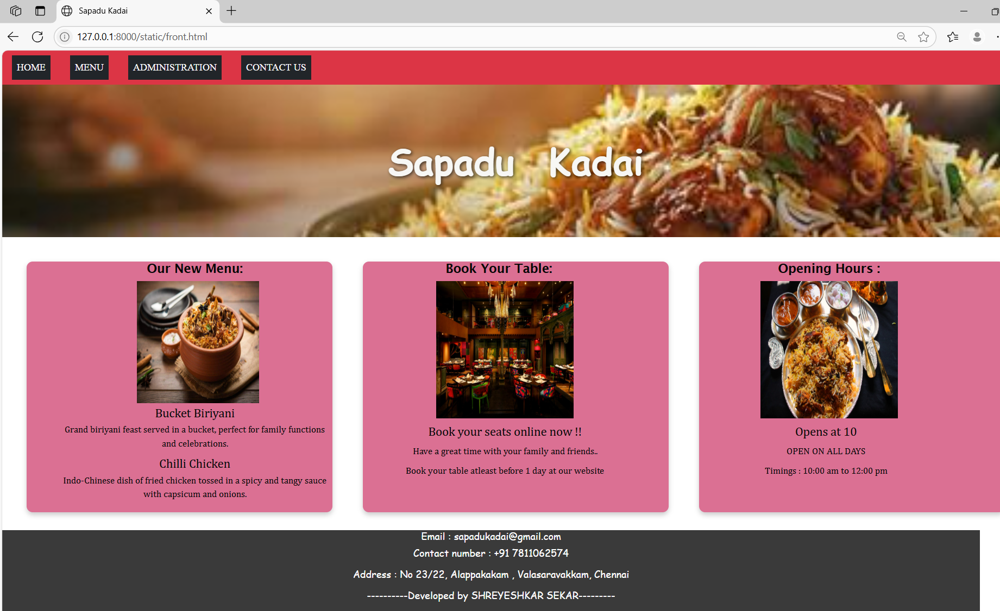
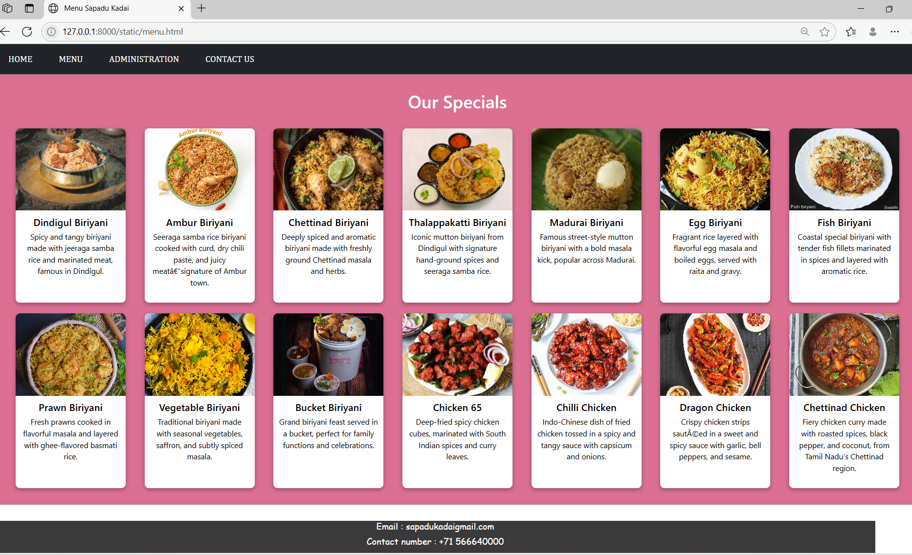
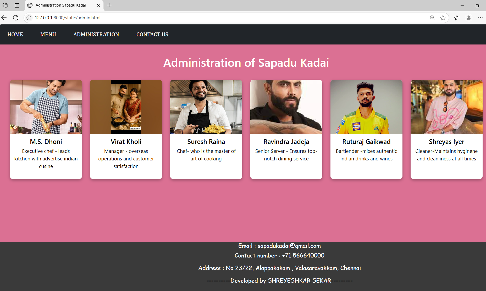
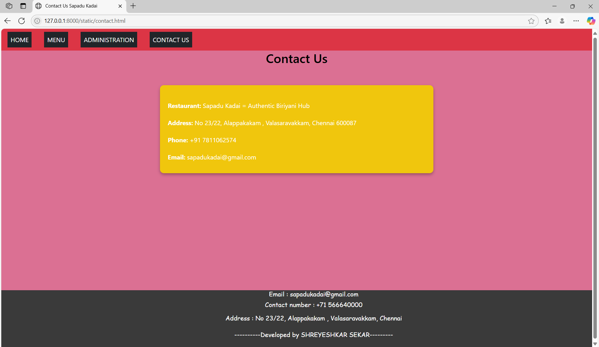

# Ex.07 Restaurant Website
## Date: 17/05/2025

## AIM:
To develop a static Restaurant website to display the food items and services provided by them.

## DESIGN STEPS:

### Step 1:
Requirement collection.

### Step 2:
Creating the layout using HTML and CSS.

### Step 3:
Updating the sample content.

### Step 4:
Choose the appropriate style and color scheme.

### Step 5:
Validate the layout in various browsers.

### Step 6:
Validate the HTML code.

### Step 7:
Publish the website in the given URL.

## PROGRAM:

```
front.html

html>
<head>
    <link href="design.css" rel="stylesheet">
    <link href="https://cdn.jsdelivr.net/npm/bootstrap@5.3.3/dist/css/bootstrap.min.css" rel="stylesheet">        
    <script src="https://cdn.jsdelivr.net/npm/bootstrap@5.3.3/dist/js/bootstrap.bundle.min.js">
    </script>
  
  <title>Sapadu Kadai</title>
  <style>
    
    .navi
    {
        font-family: 'Times New Roman', Times, serif ;

    }

    .banner {
      background-image: url('banner.jpg'); 
      background-size: cover;
      background-position: center;
      height: 250px;
      position: relative;
      display: flex;
      align-items: center;
      justify-content: center;
      color: rgb(247, 247, 244);
      text-shadow: 2px 2px 6px rgba(0, 0, 0, 0.7);
      word-spacing: 30;
    }

    .banner h1 {

      font-family:cursive;
      font-size: 60px;
      margin: 0;
      font-weight: bold;
    }
    
    
    
    .box-section {
  display: flex;
  flex-direction: row;     /* Horizontal layout */
  justify-content: flex-start;
  gap: 50px;               /* Space between the boxes */
  margin-top: 40px;        /* Top margin from banner */
  margin-left: 40px;   
  margin-right: 40px;    /* Left margin from the edge */
}

.info-box {
  background-color:palevioletred;
  color: rgb(7, 7, 7);
  width: 800px;
  height: 410px;
  display: flex;
  font-family: Cambria, Cochin, Georgia, Times, 'Times New Roman', serif;
  border-radius: 10px;
  font-size: 20px;
  box-shadow: 0 4px 8px rgba(0, 0, 0, 0.2);
  
}
.menu-content h3 {
  margin-left: 50;
  font-size: 20px;
  margin-bottom: 4px;

}
.menu-content h2 {
  margin-left: 50;
  font-size: 20px;
  margin: top 2px;
  font-family:'Lucida Sans', 'Lucida Sans Regular', 'Lucida Grande', 'Lucida Sans Unicode', Geneva, Verdana, sans-serif;

}


.menu-content p {
  margin-left: 50;
  font-size: 15px;
  margin-bottom: 10px;
  font-weight: normal;
}
.image
{
  margin-left: 60;
 
}
  </style>
</head>
<body>
    <div class="navi">
    <nav class="navbar navbar-expand-sm bg-danger">
            <ul class="navbar-nav">
                <li class="nav-item bg-dark mx-3">
                    <a class="nav-link text-white" href="front.html">HOME</a>
                </li>
                <li class="nav-item bg-dark mx-3">
                    <a class="nav-link text-white" href="menu.html">MENU</a>

                </li>
                <li class="nav-item bg-dark mx-3">
                    <a class="nav-link text-white" href="admin.html">ADMINISTRATION</a>
                </li>
                <li class="nav-item bg-dark mx-3">
                    <a class="nav-link text-white" href="contact.html">CONTACT US</a>
                </li>

            </ul>
        </nav>
    </div>

  <div class="banner">
    <h1>Sapadu Kadai</h1> 
  </div>
  
    <div class="box-section">
        <div class="info-box">
          <div class="menu-content">
            <center>
              <h2 ">Our New Menu:</h2>
                
              
                <br>

              <h3 style="margin-top: 4;">Bucket Biriyani</h3>
              <p>Grand biriyani feast served in a bucket, perfect for family functions and celebrations.</p>

              <h3>Chilli Chicken</h3>
              <p>Indo-Chinese dish of fried chicken tossed in a spicy and tangy sauce with capsicum and onions.</p>
            </center>
          </div>
        </div>
          
          
        <div class="info-box">
          <div class="menu-content">
            <center>
              <h2 style="margin-left: 50 ;">Book Your Table:</h2>
              
              <br>
              <h3 style="margin-top: 9;margin-left: 70;">  Book your seats online now !!</h3>
              <p style="margin-top: 9;margin-left: 70;">Have a great time with your family and friends..</p>
              <p style="margin-top: 9;margin-left: 70;">Book your table atleast before 1 day at our website</p>
            </center>
          </div>
        </div>
        <div class="info-box">
          <div class="menu-content">
            <center>
              <h2 style="margin-left:100;">Opening Hours :</h2>
              
              <br>
             
              <h3 style="margin-top: 9;margin-left: 90;">Opens at 10</h3>
              <p style="margin-top: 9;margin-left: 90;">OPEN ON ALL DAYS</p>
              <p style="margin-top: 9;margin-left: 90;">Timings : 10:00 am to 12:00 pm</p>

            </center>
          </div>
        </div>
        
        
      </div>
    
</body>
<footer style="background-color:rgb(58, 58, 58);height: 150;width: 1600px;color: white;text-align: center;font-family: cursive;font-size: 5;margin-top:30;">
    <h2 style="font-size:medium; margin-top: 4;">Email : sapadukadai@gmail.com </h2> <h2 style="font-size:medium;">Contact number : +91 7811062574</h2><br>
    <h2 style="font-size:medium;">Address  : No 23/22, Alappakakam , Valasaravakkam, Chennai</h2>
    <br>
    <h2 style="font-size:medium;">----------Developed by SHREYESHKAR SEKAR--------- </h2>
</footer>

</html>


menu.html


<html>
<head>
    <link href="design.css" rel="stylesheet">
    <link href="https://cdn.jsdelivr.net/npm/bootstrap@5.3.3/dist/css/bootstrap.min.css" rel="stylesheet">        
    <script src="https://cdn.jsdelivr.net/npm/bootstrap@5.3.3/dist/js/bootstrap.bundle.min.js">
    </script>
  
  <title>Menu Sapadu Kadai</title>
  <style>
    .navi
    {
        font-family: Cambria, Cochin, Georgia, Times, 'Times New Roman', serif;

    }
    .menu-section {
  background-color:palevioletred;
  padding: 30px;
  color: #fff;
  text-align: center;
}

    .menu-title {
  color: white;
  font-size: 32px;
  margin-bottom: 30px;
}

    .menu-grid {
  display: grid;
  grid-template-columns: repeat(auto-fit, minmax(200px, 1fr));
  gap: 20px;
  justify-items: center;
}

    .menu-card {
  background-color: white;
  color: black;
  border-radius: 8px;
  overflow: hidden;
  width: 200px;
  box-shadow: 0 4px 8px rgba(0,0,0,0.3);
  text-align: center;
}

    .menu-card img {
  width: 100%;
  height: 150px;
  object-fit: cover;
}

    .menu-card h3 {
  font-size: 18px;
  margin: 10px 0 5px;
}

    .menu-card p {
  font-size: 14px;
  padding: 0 10px 10px;
}

  </style>

</head>
<body>
    <div class="navi">
    <nav class="navbar navbar-expand-sm bg-dark">
            <ul class="navbar-nav">
                <li class="nav-item bg-dark mx-3">
                    <a class="nav-link text-white" href="front.html">HOME</a>
                </li>
                <li class="nav-item bg-dark mx-3">
                    <a class="nav-link text-white" href="menu.html">MENU</a>

                </li>
                <li class="nav-item bg-dark mx-3">
                    <a class="nav-link text-white" href="admin.html">ADMINISTRATION</a>
                </li>
                <li class="nav-item bg-dark mx-3">
                    <a class="nav-link text-white" href="contact.html">CONTACT US</a>
                </li>

            </ul>
        </nav>
    </div>
  <div class="menu-section">
  <h2 class="menu-title">Our Specials</h2>
  <div class="menu-grid">
    <!-- Biriyanis -->
    <div class="menu-card">
      
      <h3>Dindigul Biriyani</h3>
      <p>Spicy and tangy biriyani made with jeeraga samba rice and marinated meat, famous in Dindigul.</p>
    </div>
    <div class="menu-card">
      
      <h3>Ambur Biriyani</h3>
      <p>Seeraga samba rice biriyani cooked with curd, dry chili paste, and juicy meat—signature of Ambur town.</p>
    </div>
    <div class="menu-card">
      
      <h3>Chettinad Biriyani</h3>
      <p>Deeply spiced and aromatic biriyani made with freshly ground Chettinad masala and herbs.</p>
    </div>
    <div class="menu-card">
      
      <h3>Thalappakatti Biriyani</h3>
      <p>Iconic mutton biriyani from Dindigul with signature hand-ground spices and seeraga samba rice.</p>
    </div>
    <div class="menu-card">
      
      <h3>Madurai Biriyani</h3>
      <p>Famous street-style mutton biriyani with a bold masala kick, popular across Madurai.</p>
    </div>
    <div class="menu-card">
      
      <h3>Egg Biriyani</h3>
      <p>Fragrant rice layered with flavorful egg masala and boiled eggs, served with raita and gravy.</p>
    </div>
    <div class="menu-card">
      
      <h3>Fish Biriyani</h3>
      <p>Coastal special biriyani with tender fish fillets marinated in spices and layered with aromatic rice.</p>
    </div>
    <div class="menu-card">
      
      <h3>Prawn Biriyani</h3>
      <p>Fresh prawns cooked in flavorful masala and layered with ghee-flavored basmati rice.</p>
    </div>
    <div class="menu-card">
      
      <h3>Vegetable Biriyani</h3>
      <p>Traditional biriyani made with seasonal vegetables, saffron, and subtly spiced masala.</p>
    </div>
    <div class="menu-card">
      
      <h3>Bucket Biriyani</h3>
      <p>Grand biriyani feast served in a bucket, perfect for family functions and celebrations.</p>
    </div>
  
    <!-- Chicken Starters -->
    <div class="menu-card">
      
      <h3>Chicken 65</h3>
      <p>Deep-fried spicy chicken cubes, marinated with South Indian spices and curry leaves.</p>
    </div>
    <div class="menu-card">
      
      <h3>Chilli Chicken</h3>
      <p>Indo-Chinese dish of fried chicken tossed in a spicy and tangy sauce with capsicum and onions.</p>
    </div>
    <div class="menu-card">
      
      <h3>Dragon Chicken</h3>
      <p>Crispy chicken strips sautéed in a sweet and spicy sauce with garlic, bell peppers, and sesame.</p>
    </div>
    <div class="menu-card">
      
      <h3>Chettinad Chicken</h3>
      <p>Fiery chicken curry made with roasted spices, black pepper, and coconut, from Tamil Nadu's Chettinad region.</p>
    </div>
  </div>
</div>
</body>
<footer style="background-color:rgb(58, 58, 58);height: 150;width: 1600px;color: white;text-align: center;font-family: cursive;font-size: 5;margin-top:30;">
    <h2 style="font-size:medium; margin-top: 4;">Email : sapadukadaigmail.com </h2> <h2 style="font-size:medium;">Contact number : +71 566640000</h2><br>
    <h2 style="font-size:medium;">Address  : No 23/22, Alappakakam , Valasaravakkam, Chennai</h2>
    <br>
    <h2 style="font-size:medium;">----------Developed by SHREYESHKAR SEKAR--------- </h2>
</footer>
</html>


admin.html


<html>
<head>
    <link href="design.css" rel="stylesheet">
    <link href="https://cdn.jsdelivr.net/npm/bootstrap@5.3.3/dist/css/bootstrap.min.css" rel="stylesheet">        
    <script src="https://cdn.jsdelivr.net/npm/bootstrap@5.3.3/dist/js/bootstrap.bundle.min.js">
    </script>
  
  <title>Administration Sapadu Kadai</title>
  <style>
    .navi
    {
        font-family: Cambria, Cochin, Georgia, Times, 'Times New Roman', serif;

    }
    .menu-section {
  background-color:palevioletred;
  padding: 30px;
  color: #fff;
  text-align: center;
}

    .menu-title {
  color: white;
  font-size: 32px;
  margin-bottom: 30px;
}

    .menu-grid {
  display: grid;
  grid-template-columns: repeat(auto-fit, minmax(200px, 1fr));
  gap: 20px;
  justify-items: center;
}

    .menu-card {
  background-color: white;
  color: black;
  border-radius: 8px;
  overflow: hidden;
  width: 200px;
  box-shadow: 0 4px 8px rgba(0,0,0,0.3);
  text-align: center;
}

    .menu-card img {
  width: 100%;
  height: 150px;
  object-fit: cover;
}

    .menu-card h3 {
  font-size: 18px;
  margin: 10px 0 5px;
}

    .menu-card p {
  font-size: 14px;
  padding: 0 10px 10px;
}

  </style>

</head>
<body>
    <div class="navi">
    <nav class="navbar navbar-expand-sm bg-dark">
            <ul class="navbar-nav">
                <li class="nav-item bg-dark mx-3">
                    <a class="nav-link text-white" href="front.html">HOME</a>
                </li>
                <li class="nav-item bg-dark mx-3">
                    <a class="nav-link text-white" href="menu.html">MENU</a>

                </li>
                <li class="nav-item bg-dark mx-3">
                    <a class="nav-link text-white" href="admin.html">ADMINISTRATION</a>
                </li>
                <li class="nav-item bg-dark mx-3">
                    <a class="nav-link text-white" href="contact.html">CONTACT US</a>
                </li>

            </ul>
        </nav>
    </div>
    <div class="menu-section">
  <h2 class="menu-title">Administration of Sapadu Kadai</h2>
  <div class="menu-grid">
    <div class="menu-card">
      
      <h3>M.S. Dhoni</h3>
      <p>Executive chef - leads kitchen with advertise indian cusine</p>
    </div>
    <div class="menu-card">
      
      <h3>Virat Kholi</h3>
      <p>Manager - overseas operations and customer satisfaction</p>
    </div>
    <div class="menu-card">
      
      <h3>Suresh Raina</h3>
      <p>Chef- who is the master of art of cooking</p>
    </div>
    <div class="menu-card">
      
      <h3>Ravindra Jadeja</h3>
      <p>Senior Server - Ensures top-notch dining service</p>
    </div>
    <div class="menu-card">
      
      <h3>Ruturaj Gaikwad</h3>
      <p>Bartlender -mixes authentic indian drinks and wines</p>
    </div>
    <div class="menu-card">
      
      <h3>Shreyas Iyer</h3>
      <p>Cleaner-Maintains hyginene and cleanliness at all times</p>
    </div>
</div>
</body>
    <footer style="background-color:rgb(58, 58, 58);height: 150;width: 1600px;color: white;text-align: center;font-family: cursive;font-size: 5;margin-top: 175;margin-left: -50;">
    <h2 style="font-size:medium; margin-top: 4;">Email : sapadukadai@gmail.com </h2> <h2 style="font-size:medium;">Contact number : +71 566640000</h2><br>
    <h2 style="font-size:medium;">Address  : No 23/22, Alappakakam , Valasaravakkam, Chennai</h2>
    <br>
    <h2 style="font-size:medium;">----------Developed by SHREYESHKAR SEKAR--------- </h2>
</footer>
</html>


contact.html

<html>
    <head>
        <link href="design.css" rel="stylesheet">
        <link href="https://cdn.jsdelivr.net/npm/bootstrap@5.3.3/dist/css/bootstrap.min.css" rel="stylesheet">        
        <script src="https://cdn.jsdelivr.net/npm/bootstrap@5.3.3/dist/js/bootstrap.bundle.min.js">
        </script>
      
      <title>Administration Sapadu Kadai</title>
      <style>
        .navi
        {
            font-family: Cambria, Cochin, Georgia, Times, 'Times New Roman', serif;
    
        }
        .menu-section {
      background-color:palevioletred;
      padding: 30px;
      color: #fff;
      text-align: center;
    }
    
        .menu-title {
      color: white;
      font-size: 32px;
      margin-bottom: 30px;
    }
    
        .menu-grid {
      display: grid;
      grid-template-columns: repeat(auto-fit, minmax(200px, 1fr));
      gap: 20px;
      justify-items: center;
    }
    
        .menu-card {
      background-color: white;
      color: black;
      border-radius: 8px;
      overflow: hidden;
      width: 200px;
      box-shadow: 0 4px 8px rgba(0,0,0,0.3);
      text-align: center;
    }
    
        .menu-card img {
      width: 100%;
      height: 150px;
      object-fit: cover;
    }
    
        .menu-card h3 {
      font-size: 18px;
      margin: 10px 0 5px;
    }
    
        .menu-card p {
      font-size: 14px;
      padding: 0 10px 10px;
    }
    
      </style>
    
    </head>
    <body>
        <div class="navi">
        <nav class="navbar navbar-expand-sm bg-dark">
                <ul class="navbar-nav">
                    <li class="nav-item bg-dark mx-3">
                        <a class="nav-link text-white" href="front.html">HOME</a>
                    </li>
                    <li class="nav-item bg-dark mx-3">
                        <a class="nav-link text-white" href="menu.html">MENU</a>
    
                    </li>
                    <li class="nav-item bg-dark mx-3">
                        <a class="nav-link text-white" href="admin.html">ADMINISTRATION</a>
                    </li>
                    <li class="nav-item bg-dark mx-3">
                        <a class="nav-link text-white" href="contact.html">CONTACT US</a>
                    </li>
    
                </ul>
            </nav>
        </div>
        <div class="menu-section">
    
      
  
    </body>
        <footer style="background-color:rgb(58, 58, 58);height: 150;width: 1600px;color: white;text-align: center;font-family: cursive;font-size: 5;margin-top: 175;margin-left: -50;">
        <h2 style="font-size:medium; margin-top: 4;">Email : sapadukadai@gmail.com </h2> <h2 style="font-size:medium;">Contact number : +71 566640000</h2><br>
        <h2 style="font-size:medium;">Address  : No 23/22, Alappakakam , Valasaravakkam, Chennai</h2>
        <br>
        <h2 style="font-size:medium;">----------Developed by SHREYESHKAR SEKAR--------- </h2>
    </footer>
    </html>


```


## OUTPUT:









## RESULT:
The program for designing software company website using HTML and CSS is completed successfully.
